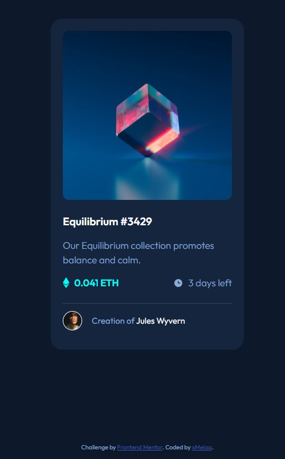

# Frontend Mentor - NFT preview card component solution

This is a solution to the [NFT preview card component challenge on Frontend Mentor](https://www.frontendmentor.io/challenges/nft-preview-card-component-SbdUL_w0U). Frontend Mentor challenges help you improve your coding skills by building realistic projects. 

## Table of contents

- [Overview](#overview)
  - [The challenge](#the-challenge)
  - [Screenshot](#screenshot)
  - [Links](#links)
- [My process](#my-process)
  - [Built with](#built-with)
  - [What I learned](#what-i-learned)
- [Author](#author)

## Overview

### The challenge

Users should be able to:

- View the optimal layout depending on their device's screen size
- See hover states for interactive elements

### Screenshot



### Links

- Live Site URL: [Github Pages](https://xmelaa.github.io/Nft-card/)

## My process

### Built with

- Semantic HTML5 markup
- CSS custom properties

### What I learned

I have learned how to make an image overlay with half-transparent background and icon with full opacity:

```
.card__nft-image-wrapper:hover::after {
  content: "";
  position: absolute;
  inset: 0;
  background-color: hsla(178, 100%, 50%, 0.5);
  background-image: url("/images/icon-view.svg");
  background-repeat: no-repeat;
  background-position: center;
  cursor: pointer;
}
```
That was the hardest part. Also difficult was to estimate the exact distances between the components without Figma.

## Author

- Frontend Mentor - [@xMelaa](https://www.frontendmentor.io/profile/xMelaa)